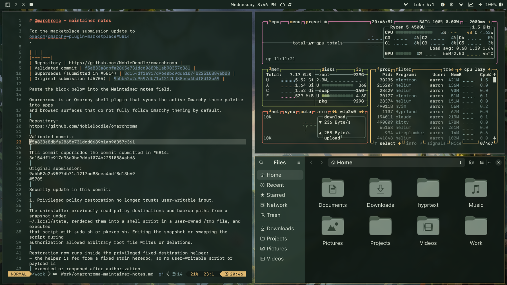

# Primeval Dawn



**A warm Mesozoic jungle palette for [Omarchy](https://omarchy.org).**

Deep forest-green surfaces (`#17241e`) under a low golden sun (`#e8bd72`),
with moss, clay, and orchid accents drawn from the wallpapers themselves. Dark
mode, soft contrast, no neon.

## Install

```bash
omarchy theme install https://github.com/NobleDoodle/omarchy-primeval-dawn-theme
```

## Contents

| Path             | What it is                                              |
| ---------------- | ------------------------------------------------------- |
| `colors.toml`    | The palette Omarchy compiles into every app template    |
| `icons.theme`    | Icon theme name (`Yaru-sage`)                           |
| `backgrounds/`   | Wallpapers, cycled by the Omarchy background switcher   |
| `preview.png`    | Theme-switcher preview, 1800x1012 like the stock themes  |
| `unlock.png`     | Boot-splash logo, used by `omarchy plymouth set-by-theme` |


## Boot splash

`unlock.png` is the `omarchy` wordmark in gold on transparency. Omarchy draws it
at native size over the theme's background color, so it is sized like the stock
themes' logos rather than being a full-screen image. Apply it with:

```bash
omarchy plymouth set-by-theme primeval-dawn   # needs sudo
```

## Suggested Wallpaper Additions

Anything with dark green and warm tones, and if you want to stick to the theme - dinosaurs of course. Then starts the running and the screaming.

